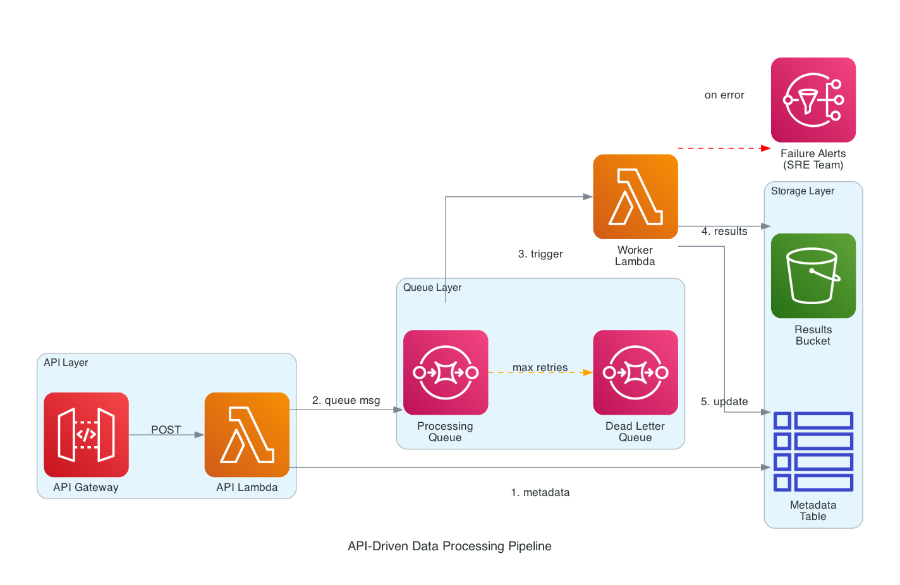

# API-Driven Data Processing Pipeline with AWS CDK (Python)

A practical event-driven architecture for async data processing using API Gateway, Lambda, SQS, S3, DynamoDB, and SNS.

## Architecture



### Components

**API Layer**
- **API Gateway**: REST endpoint for client requests
- **API Lambda**: Validates requests, stores metadata, queues work

**Queue Layer**
- **Processing Queue**: Buffers messages for async processing
- **Dead Letter Queue**: Captures failed messages after max retries

**Worker Layer**
- **Worker Lambda**: Processes messages, stores results, handles errors

**Storage Layer**
- **S3 Bucket**: Stores processing results
- **DynamoDB Table**: Tracks request status and metadata

**Notification Layer**
- **SNS Topic**: Alerts SRE team on processing failures

### Flow

1. Client sends POST request → API Gateway → API Lambda
2. API Lambda stores metadata in DynamoDB
3. API Lambda queues message to SQS
4. Worker Lambda triggered by SQS message
5. Worker processes data and stores results in S3
6. Worker updates status in DynamoDB
7. On error: Worker publishes alert to SNS
8. After max retries: Message moves to DLQ

## Project Structure

```
.
├── app.py                          # CDK app entry point
├── event_driven_stack.py           # Main stack orchestration
├── constructs/
│   ├── api_construct.py            # API Gateway + API Lambda
│   ├── queue_construct.py          # SQS queues (main + DLQ)
│   ├── storage_construct.py        # S3 + DynamoDB
│   ├── worker_construct.py         # Worker Lambda
│   └── notification_construct.py   # SNS topic
├── cdk.json                        # CDK configuration
└── requirements.txt                # Python dependencies
```

## Setup

Create a virtual environment and install dependencies:

```bash
python3 -m venv .venv
source .venv/bin/activate
pip install -r requirements.txt
```

## Deploy

```bash
cdk bootstrap  # First time only
cdk deploy
```

## Test

Submit a request:
```bash
curl -X POST <ApiUrl> \
  -H "Content-Type: application/json" \
  -d '{"data": "test payload"}'
```

Subscribe to notifications:
```bash
aws sns subscribe --topic-arn <TopicArn> --protocol email --notification-endpoint sre-team@example.com
```

## Clean Up

```bash
cdk destroy
```
